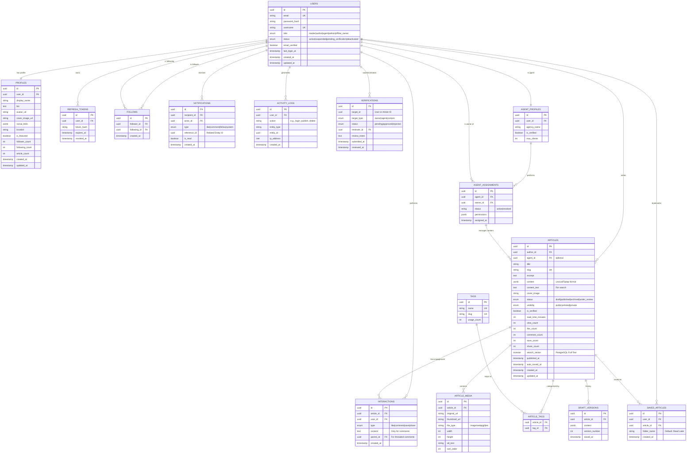

# ArtiSea Technical Data ERD

This document defines the comprehensive database schema for the ArtiSea platform, including support for the Social discovery engine, Agent-Owner workflows, and unified interaction systems.

