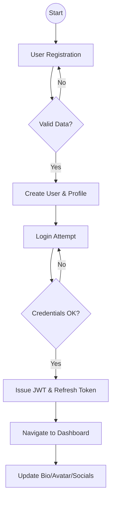
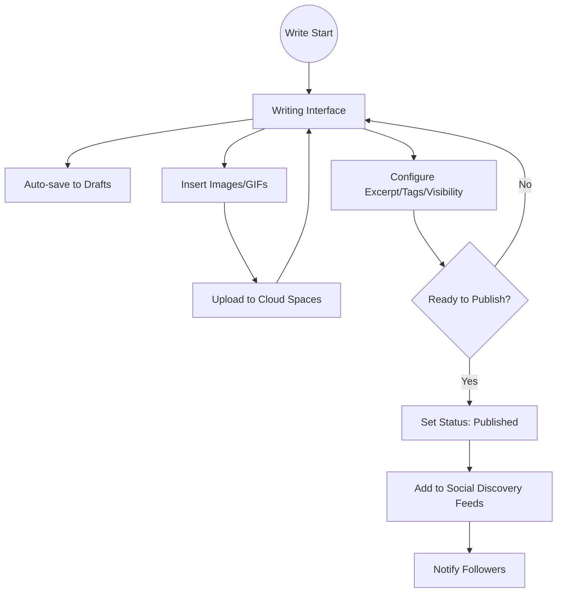
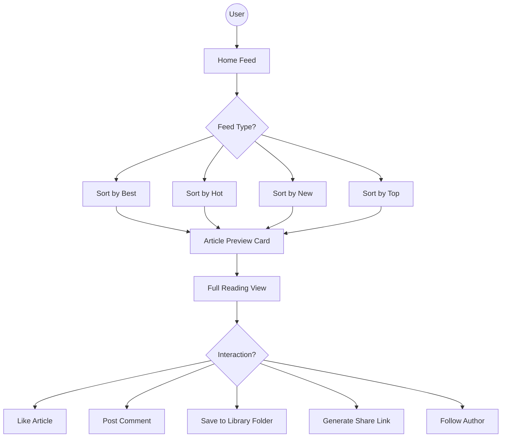
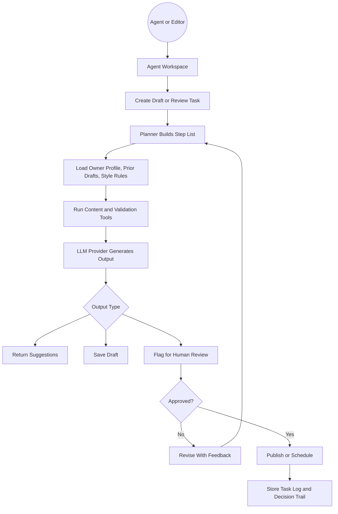
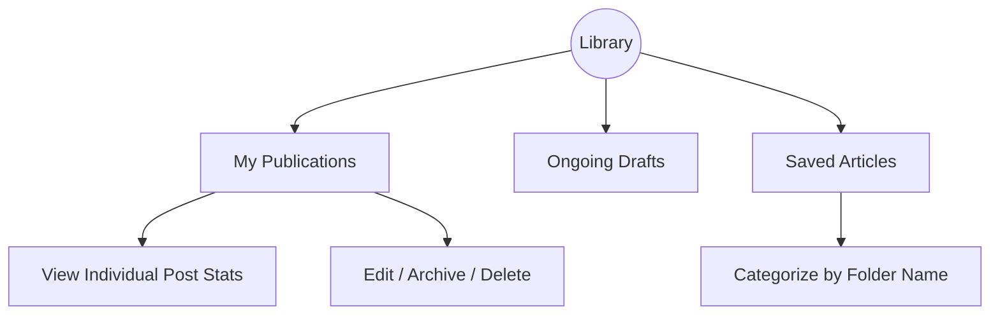

# ArtiSea System Process Flows

This document details the granular process flows for the ArtiSea platform. You can copy the Mermaid code blocks below and paste them into [draw.io](https://app.diagrams.net/) (via `Insert > Advanced > Mermaid`).

## 1. Authentication & Identity Flow

## 2. Article Lifecycle (Authoring to Publishing)

## 3. Discovery & Community Interaction

## 4. AI Agent Workflow (Drafting, Review, Publish)

## 5. Library & Content Management

