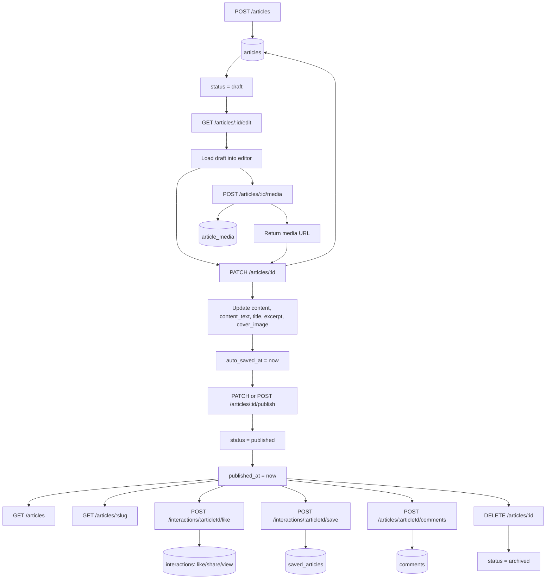

# Article API Architecture Review

Design review of the article editor, media, and interactions layer.

## What Is Solid

`articles.id` as the universal connector is correct. Every mutation, interaction, media record, and publish action should anchor to the same UUID.

The draft to published to archived lifecycle is also correct. `DELETE` setting `status = 'archived'` instead of hard-deleting preserves data for analytics and allows restore later.

The slug/id split is right:

```text
articles.id      all mutations and internal links
articles.slug    public article reads
```

`PATCH /articles/:id` as the auto-save/edit endpoint is a good design because the frontend keeps updating the same draft row.

## Critical Issues

### 1. Save/bookmark is in the wrong table

Current backend stores saves in `interactions` with `type = save`.

Target design has a separate `saved_articles` table with extra save-specific data like `folder_name`.

These two designs conflict. Pick one and commit.

Recommended:

```text
POST   /interactions/:articleId/save      insert into saved_articles
DELETE /interactions/:articleId/save      delete from saved_articles
```

Do not write saves to both `interactions` and `saved_articles`.

### 2. Comments should not live in interactions

Current backend stores comments in `interactions.content` with `type = comment`.

This makes comment-specific features harder:

- Threaded replies
- Edit comment
- Soft delete comment
- Comment moderation
- Independent comment pagination
- Reliable `comment_count`

Recommended table:

```sql
CREATE TABLE comments (
  id          UUID PRIMARY KEY DEFAULT gen_random_uuid(),
  article_id  UUID REFERENCES articles(id),
  author_id   UUID REFERENCES users(id),
  parent_id   UUID REFERENCES comments(id),
  content     TEXT NOT NULL,
  is_deleted  BOOLEAN DEFAULT false,
  created_at  TIMESTAMPTZ DEFAULT now(),
  updated_at  TIMESTAMPTZ DEFAULT now()
);
```

Keep `interactions` for stateless signals like `like`, `view`, and `share`.

### 3. Counter columns can drift

`articles.like_count`, `comment_count`, `save_count`, and similar counters are denormalized cache fields.

They can drift if requests race, fail midway, or roll back after a partial update.

Recommended:

```sql
CREATE OR REPLACE FUNCTION sync_article_counts() RETURNS void AS $$
BEGIN
  UPDATE articles a SET
    like_count = (
      SELECT count(*)
      FROM interactions
      WHERE article_id = a.id AND type = 'like'
    ),
    comment_count = (
      SELECT count(*)
      FROM comments
      WHERE article_id = a.id AND is_deleted = false
    ),
    save_count = (
      SELECT count(*)
      FROM saved_articles
      WHERE article_id = a.id
    );
END;
$$ LANGUAGE plpgsql;
```

Use triggers, transactions, or a scheduled sync job.

## Design Gaps

### 4. Like/save need database idempotency

The current service toggles likes and saves by checking if a row exists first. That prevents normal duplicates, but two fast requests can still race.

Add a unique constraint:

```sql
ALTER TABLE interactions
  ADD CONSTRAINT uq_user_article_type
  UNIQUE (user_id, article_id, type);
```

Use upsert or separate endpoints:

```text
POST   /interactions/:articleId/like
DELETE /interactions/:articleId/like
```

### 5. GET /articles needs stronger pagination and filters

Target query support:

```text
GET /articles?page=1&limit=20&sort=published_at&order=desc
GET /articles?tag=javascript&author=:userId
GET /articles?search=nodejs
```

Use `search_vector` for PostgreSQL full-text search:

```sql
WHERE search_vector @@ plainto_tsquery('english', $1)
ORDER BY ts_rank(search_vector, plainto_tsquery('english', $1)) DESC
```

### 6. Media upload should write article_media

Current backend has:

```text
POST /media/upload
```

It uploads to Cloudinary and returns a URL, but it does not create an `article_media` record.

Recommended:

```text
POST /articles/:id/media
```

Flow:

```text
1. Verify current user owns article
2. Upload file to Cloudinary/S3/R2
3. Insert article_media row
4. Return { id, url, width, height, alt_text }
5. Editor inserts URL into articles.content JSON
6. PATCH /articles/:id autosaves the content JSON
```

### 7. Missing editor-load endpoint

Current backend has create, patch, publish, and drafts list, but no direct endpoint to open one draft in the editor.

Recommended:

```text
GET /articles/:id/edit
```

Response:

```json
{
  "id": "article uuid",
  "title": "Draft title",
  "slug": "draft-title-1770000000000",
  "excerpt": "Short summary",
  "content": {},
  "content_text": "Plain text",
  "cover_image": "https://...",
  "status": "draft",
  "visibility": "public",
  "media": []
}
```

## Revised Clean API Map

### Auth-Gated Article Write Operations

```text
POST   /articles                    create draft, returns { id }
GET    /articles/:id/edit           load draft for editor
PATCH  /articles/:id                auto-save content, title, excerpt
POST   /articles/:id/media          upload image, write article_media, return URL
PATCH  /articles/:id/publish        draft to published
DELETE /articles/:id                published/draft to archived
```

### Public Read Operations

```text
GET /articles                       paginated published feed
GET /articles/:slug                 single published article
```

### Interactions

```text
POST   /interactions/:articleId/like       like
DELETE /interactions/:articleId/like       unlike
POST   /interactions/:articleId/save       save into saved_articles
DELETE /interactions/:articleId/save       unsave
GET    /articles/:articleId/comments       paginated comments
POST   /articles/:articleId/comments       create comment
DELETE /comments/:commentId                soft-delete own comment
```

## Content Field Connections

| Field               | Written by                           | When                                       |
| ------------------- | ------------------------------------ | ------------------------------------------ |
| `content`           | `PATCH /articles/:id`                | Every auto-save                            |
| `content_text`      | `PATCH /articles/:id`                | Every auto-save, stripped from editor JSON |
| `cover_image`       | `PATCH /articles/:id`                | When cover image is set                    |
| `read_time_minutes` | `PATCH /articles/:id`                | Computed from word count                   |
| `search_vector`     | DB trigger                           | On title/excerpt/content_text change       |
| `status`            | `PATCH /articles/:id/publish`        | On publish                                 |
| `published_at`      | `PATCH /articles/:id/publish`        | On publish                                 |
| `auto_saved_at`     | `PATCH /articles/:id`                | Every auto-save                            |
| `article_media.*`   | `POST /articles/:id/media`           | On image upload                            |
| `saved_articles.*`  | `POST /interactions/:articleId/save` | On bookmark                                |

## Flow Diagram



## Summary

| Severity | Issue                              | Fix                                              |
| -------- | ---------------------------------- | ------------------------------------------------ |
| Critical | Saves mixed into interactions      | Route saves to `saved_articles` only             |
| Critical | Comments stored in interactions    | Add separate `comments` table                    |
| Critical | Counters can drift                 | Add trigger, transaction discipline, or sync job |
| Medium   | Like/save race duplicates possible | Add unique constraint and upsert                 |
| Medium   | `article_media` never written      | Add `POST /articles/:id/media`                   |
| Medium   | No editor-load endpoint            | Add `GET /articles/:id/edit`                     |
| Medium   | Feed filters/search are weak       | Add pagination, filters, and full-text search    |

The backbone is correct: `articles.id` as universal connector, draft/publish/archive lifecycle, and slug/id separation. The main refactor area is the interaction layer, media tracking, and counter reliability.
