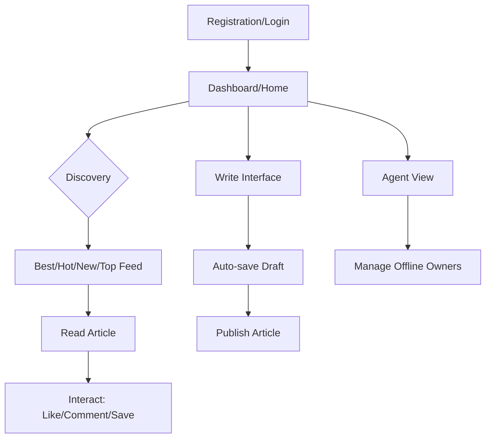
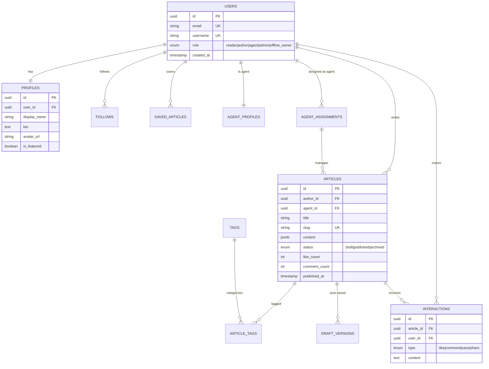

# ArtiSea Software Requirements Specification

## 1. Introduction

ArtiSea is a global digital publishing platform designed to provide an efficient, distraction-free environment for writers to create and share their work worldwide. It bridges the gap between professional document editors and social publishing platforms, focusing on premium typography and community-driven discovery.

## 2. Objectives

- **Immersive Consumption:** A high-quality browsing and reading interface optimized for long-form content using a **modern sans-serif (Inter) typography stack**.
- **Social-Centric Architecture:** A content-first **3-column layout** (Navigation | Feed | Community Widgets) that maximizes engagement and content density.
- **Native-Like Authoring:** A professional-grade writing interface that provides a native document-like experience with integrated media tools and auto-save capabilities.
- **Rich Media Support:** Seamless integration of link attachments, high-resolution images, and GIFs to enhance storytelling.

## 3. Project Scope

### 3.1 In Scope

- **Identity & Access Management:** Secure registration, login, and comprehensive user profile management with JWT-based authentication.
- **Article Lifecycle:** Tools for writing, editing, saving drafts, and publishing articles with a minimalist markdown-ready editor.
- **Social Discovery Engine:** Community-driven discovery via **Best, Hot, New, and Top** feed classifications.
- **Consolidated Interactions:** A unified interaction system including **Likes, Comments, Shares, and Saves**, replacing complex voting systems with high-density engagement tools.
- **Agent Workflow:** Specialized infrastructure for **Agents** to manage, verify, and publish content on behalf of offline owners or multiple clients.
- **Library Management:** A private interface for users to organize their own published works and curated saved content.

### 3.2 Out of Scope (Advanced Features)

- Monetization and subscription paywalls.
- Collaboration/Co-authoring modes.
- Native mobile application development (Primary focus is a responsive, PWA-ready Web experience).

## 4. Feasibility Study

### 4.1 Technical Feasibility

| Layer        | Technology                | Justification                                                 |
| ------------ | ------------------------- | ------------------------------------------------------------- |
| **Frontend** | Next.js (App Router)      | Ensures superior SEO, fast initial page loads, and seamless SSR |
| **Styling**  | Tailwind CSS + Inter Font | Modern utility-first styling with a clean sans-serif aesthetic |
| **Backend**  | Node.js + NestJS          | Structured, scalable microservices-ready architecture         |
| **Database** | PostgreSQL                | Robust relational data management and complex query handling  |
| **Hosting**  | Digital Ocean             | Reliable cloud infrastructure with scalable droplets and Spaces |

### 4.2 Legal & Security Feasibility

- **Data Protection:** Implementation of encryption at rest and in transit for user data.
- **Content Rights:** Terms of Service defining intellectual property ownership for authors.

## 5. Requirement Analysis

### 5.1 Functional Requirements

- **Drafting System:** Robust auto-save functionality to prevent data loss during the writing process.
- **Discovery Hierarchy:** Ability to filter and sort content by community relevance (Best/Hot) or recency (New).
- **Agent Dashboards:** Toggleable views for Agents to manage author assignments and verify publication content.
- **Notification Engine:** Real-time alerts for community interactions (follows, comments, likes).

### 5.2 Non-Functional Requirements

- **Aesthetics:** Premium, minimalist design using glassmorphism, subtle micro-animations, and high-density content cards.
- **Performance:** Optimized rendering for media-heavy articles and fast cross-route transitions.
- **Security:** Robust JWT session management and protected server-side routing.

## 6. User Journey Flow

## 7. Senior Dev Evaluation & Challenges

| Challenge                 | Recommendation                                                                                                                                                                 |
| ------------------------- | ------------------------------------------------------------------------------------------------------------------------------------------------------------------------------ |
| **Search Performance**    | Standard SQL `LIKE` queries will fail at scale. Utilize **PostgreSQL Full-Text Search (tsvector)** or Meilisearch for high-performance discovery.                              |
| **The Editor Experience** | Native document editing is complex. Leverage **Tiptap** or **Lexical** to provide a rich, stable writing experience.                                                           |
| **Media Management**      | Use **Digital Ocean Spaces (S3 compatible)** for hosting high-res GIFs and images to maintain application performance.                                                         |
| **Social Density**        | Maintain a **3-column layout** to keep the interface "alive" with community widgets without cluttering the primary reading experience.                                         |

## 8. API Design

### 8.1 Identity & Access Management
- `POST /api/v1/auth/register`: User account creation.
- `POST /api/v1/auth/login`: Authentication with JWT issuance.
- `GET /api/v1/profiles/:username`: Public profile retrieval.
- `PATCH /api/v1/profiles/me`: Self-profile updates.

### 8.2 Article & Discovery
- `GET /api/v1/articles`: List articles with `?feed=best|hot|new|top` and search params.
- `GET /api/v1/articles/:slug`: Retrieve full content by slug.
- `POST /api/v1/articles`: Initialize new draft.
- `PUT /api/v1/articles/:id`: Auto-save article updates.
- `PATCH /api/v1/articles/:id/status`: Transition between draft/published.

### 8.3 Social & Interaction
- `POST /api/v1/articles/:id/interact`: Unified interaction (Like/Save/Comment).
- `POST /api/v1/authors/:id/follow`: Follow/unfollow author toggle.

## 9. Database Design (PostgreSQL)

